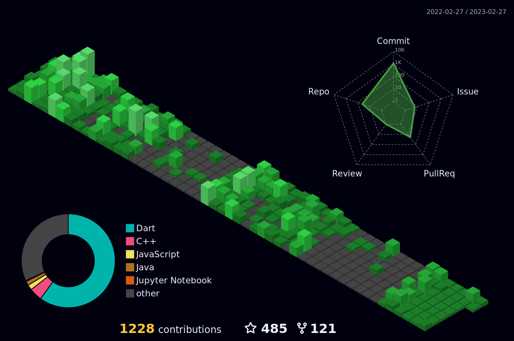

  

  

<!--  --->
	

	

<!--- social media icons, you can find them in assets directory of this repo --->
  
 

 

<a href="https://www.youtube.com/c/rashidwassan">
    

<!--- a bit of vertical space & languages text --->
<!--  -->

<!--- language icons --->
<!-- 

 -->

&nbsp;

<h1 align="center">
  ABOUT ME
</h1>
  

	
I'm eager to learn about a wide range of technical stuff, like assembly language and how to make modern jets better with technology. I like to figure out if we can make things work automatically. I'm always trying to become a really good Software Engineer by exploring different ideas in the field.

My Skillset:
◆ IBM Cloud & GCP
◆ Ansible
◆ Terraform
◆ Docker
◆ Kubernetes
◆ GitHub Actions + Tekton (CI/CD) + Jenkins
◆ Test Driven Development, Software Testing
◆ GNU Linux, Namespaces & Containerization
◆ Microservices Architecture and Best Practices
◆ Sound Understanding of Computer Hardware
◆ Blockchain Core Development
◆ Dart & Flutter (3 years of part-time work experience)
◆ Software Engineering Best Practices
◆ Deeper Understanding of Computer Hardware
◆ Computer Architecture and Electronics

I often come up with implementing my own ideas and using my own software solutions to increase productivity.

<!--- adding 3D earth icon to show some love for the environment 🌏 --->

  
  

<!--- 
 
 --->

## Stackoverflow Reputation 

  

  

 
 
<!---
# Github Contributions
<h4 align="center">Isometric view of contributions in the last year</h4>

	

# Github Metrics

	

--->
