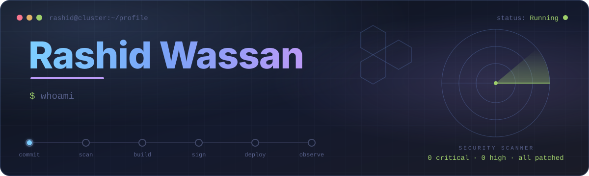
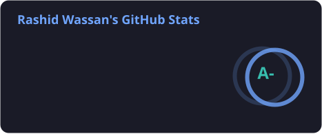
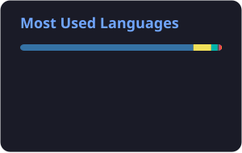

<!--
  👋 Reading the source? Respect.
  This profile is shipped by its own pipeline: .github/workflows/profile-pipeline.yml
  Stats, streak and the snake below are rebuilt every night by GitHub Actions.
-->

<p align="center">
  
</p>

<p align="center">
  <!--  -->
  <a href="https://wakatime.com/@94dec0b3-75bc-4456-b8ac-37697338e4ac"></a>
  
</p>

<br>

## ☸️ `kubectl get engineer rashid-wassan -o yaml`

```yaml
apiVersion: humans.dev/v1
kind: Engineer
metadata:
  name: rashid-wassan
  namespace: fintech-and-egovernance
  labels:
    role: devsecops
    experience: 3-years
    open-to: collaboration
  annotations:
    website: https://rashidwassan.com
spec:
  replicas: 1                      # one of one, no failover available
  currentlyWorkingOn:
    - DevSecOps for fintech & e-governance platforms
  learning:
    - Kubernetes, the deep end
    - DevSecOps
  lookingToCollaborateOn:
    - open-source DevOps
    - developer tooling
  askMeAbout:
    - community
    - all things tech
  sideQuest:
    - 'AI Prompting: Zero to Hero, a video course taught in Sindhi'
  securityContext:
    runAsNonRoot: true
    allowPrivilegeEscalation: false
    readOnlyRootFilesystem: true   # trust, but verify
status:
  phase: Running
  conditions:
    - type: Learning
      status: "True"
    - type: OpenToCollab
      status: "True"
```

<br>

## 🧰 Toolchain

<p align="center"><sub><b>PLATFORM &nbsp;·&nbsp; CLOUD</b></sub><br><br>
  
</p>

<p align="center"><sub><b>PIPELINES &nbsp;·&nbsp; STREAMING &nbsp;·&nbsp; OBSERVABILITY</b></sub><br><br>
  
</p>

<p align="center"><sub><b>LANGUAGES &nbsp;·&nbsp; APPS &nbsp;·&nbsp; HARDWARE</b></sub><br><br>
  
</p>

<p align="center">
  
</p>

<br>

## 🚀 Shipped to production

<table>
  <tr>
    <td width="33%" valign="top">
      <h3>🛡️ FILOS</h3>
      An insurance distribution management system for the European market.
      <br><br>
      <code>insurance</code> <code>europe</code>
    </td>
    <td width="33%" valign="top">
      <h3>📦 Unilever LeverEdge</h3>
      Unilever's distribution management system, powering their business across 30+ countries.
      <br><br>
      <code>distribution</code> <code>30+ countries</code>
    </td>
    <td width="33%" valign="top">
      <h3>📱 Strapi Mobile Admin</h3>
      A user-friendly admin panel app for Strapi CMS, for managing backend resources on the go.
      <br><br>
      <code>cms</code> <code>mobile</code>
    </td>
  </tr>
</table>

<br>

## 📡 Telemetry

<p align="center">
  
  
</p>

<p align="center">
  
</p>

<p align="center">
  <a href="https://stackoverflow.com/users/15750590/rashid-wassan">
    
  </a>
</p>

<p align="center">
  <picture>
    <source media="(prefers-color-scheme: dark)" srcset="./profile/snake-dark.svg" />
    <source media="(prefers-color-scheme: light)" srcset="./profile/snake.svg" />
    
  </picture>
</p>

<br>

## 🔐 Security finding

> [!WARNING]
> **secret-scanner:** 1 high-entropy string detected in `README.md`. Severity: *curious*.

```bash
RASHID_SECRET="WW91IGZvdW5kIGl0ISBUaGF0IGN1cmlvc2l0eSBpcyBleGFjdGx5IHdoYXQgSSBsb29rIGZvciBpbiBhIHRlYW1tYXRlLiBMZXQncyBidWlsZCBzb21ldGhpbmcgdG9nZXRoZXI6IHJhc2hpZHdhc3Nhbi5jb20="
```

<details>
<summary><b>🔓 Decode it</b> (or run <code>base64 -d</code> yourself, you know you want to)</summary>
<br>

```console
$ echo "$RASHID_SECRET" | base64 -d
You found it! That curiosity is exactly what I look for in a teammate. Let's build something together: rashidwassan.com
```

</details>

<br>

## 🤝 Open a connection

<p align="center">
  <a href="https://rashidwassan.com"></a>
  <a href="https://www.linkedin.com/in/rashidwassan/"></a>
  <a href="https://x.com/rashidwassan_"></a>
  <a href="https://www.instagram.com/rashidwassan_"></a>
  <br>
  <a href="https://www.youtube.com/c/rashidwassan"></a>
  <a href="https://stackoverflow.com/users/15750590/rashid-wassan"></a>
  <a href="https://dev.to/rashidwassan"></a>
</p>

<br>

```console
$ kubectl rollout status deployment/your-visit
deployment "your-visit" successfully rolled out ✔  thanks for stopping by!
```
